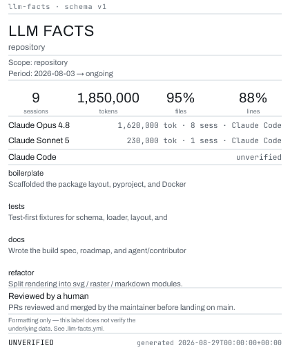

# llm-facts

<!-- Demo: this label was rendered by the app itself from this repo's
     .llm-facts.yml — `llm-facts render --format all`. -->
<p align="center">
  
</p>

Render a conformant `.llm-facts.yml` into a label — SVG, PNG, or Markdown.
Formatting only: the file in, a rendered label out. No telemetry collection, no
log parsing, no data verification beyond internal consistency checks.

> **Status: alpha.** The renderer is built and working end to end — schema
> validation, layout, SVG/PNG/Markdown rendering, the CLI, and the GitHub
> Action. See [`docs/spec.md`](docs/spec.md) for the build spec and
> [`AGENTS.md`](AGENTS.md) for how it's built.

## What it does

A Python CLI, wrapped by a Docker-based GitHub Action:

```
llm-facts init                 # scaffold a blank .llm-facts.yml
llm-facts validate [path]      # schema check, exit code only
llm-facts render [path]        # --format svg|png|md|all  (default: png)
```

The Action renders on push to `.llm-facts.yml` and commits the image back to the
branch.

## Develop

Not published to PyPI yet. For local work:

```
git clone https://github.com/bardic-inspiration/llm-facts
cd llm-facts
pip install -e .[dev]
pytest
```

The build is test-first and lands in small, atomic steps — see
[`CONTRIBUTING.md`](CONTRIBUTING.md).

## Documentation

| Doc | Purpose |
|---|---|
| [Build spec](docs/spec.md) | Authoritative source of truth for behavior |
| [Issue standards](docs/issue-standards.md) | How to pick up, file, and scope issues |
| [Spec guidelines](docs/spec-guidelines.md) | How to read and change the spec |
| [Testing standards](docs/testing-standards.md) | TDD workflow (required) |
| [Commit standards](docs/commit-standards.md) | Atomic + Conventional Commits |
| [Documentation standards](docs/documentation-standards.md) | Voice and structure |
| [Contributing](CONTRIBUTING.md) | Workflow from clone to PR |
| [Agent guide](AGENTS.md) | Instructions for AI coding agents |

## License

[MIT](LICENSE).
